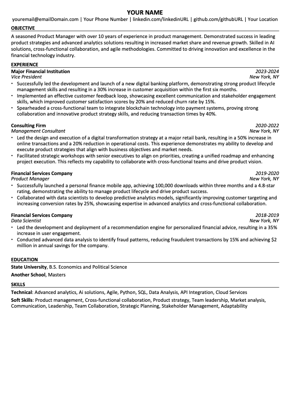

<h1 align="center">
  <picture>
    <source media="(prefers-color-scheme: dark)" srcset="images/ResumeGPT-light.png"/>
    <source media="(prefers-color-scheme: light)" srcset="images/ResumeGPT.png"/>
    
 <br />
</h1>

<div align="center">

<p align="center">
  <a href="#features">
    <b>Features</b>
  </a>
     · 
  <a href="#installation">
    <b>Install</b>
  </a>
     · 
  <a href="#usage">
    <b>Usage</b>
  </a>
      · 
  <a href="#discussions">
    <b>Discussions</b>
  </a>
     · 
  <a href="#contributors">
    <b>Contributors</b>
  </a>

</p>


<br>


</div>

<br>

<h3 align="center">Tailor your resume to match any job posting effortlessly with ResumeGPT.
</h3>

<br/>
ResumeGPT allows you to simply provide your resume and a job posting link, and it will produce a formatted ATS friendly PDF resume that is optimized and personalize your resume to align with the specific requirements and keywords of the job. 

## Features
- Extracts relevant skills, qualifications, and keywords from a job posting.
- Tailors your curent resume to match job requirements.
- Generates professional ATS friendly PDF resumes.
- Allows for user verification and customization before finalizing the resume.

## Installation

```bash
pip install ResumeGPT
```

or:

```bash
pip install git+https://github.com/takline/ResumeGPT.git
```

or:


```bash
git clone https://github.com/takline/ResumeGPT.git
cd ResumeGPT
pip install -r requirements.txt
```

## Usage

 - Add your resume to `ResumeGPT/data/sample_resume.yaml` (make sure `ResumeGPT.config.YOUR_RESUME_NAME` is set to your resume filename in the `.data/` folder)
 - Provide ResumeGPT with the link to a job posting and it will tailot your resume to the job:

### Single job posting usage
```python
url = "https://[link to your job posting]"
resume_improver = ResumeGPT.services.ResumeImprover(url)
resume_improver.create_draft_tailored_resume()
```

ResumeGPT then creates a new resume YAML file in a new folder named after the job posting (`ResumeGPT/data/[Company_Name_Job_Title]/resume.yaml`) with a YAML key/value: `editing: true`. ResumeGPT will wait for you to update this key to verify the resume updates and allow them to make their own updates until users set `editing=false`. Then ResumeGPT will create a PDF version of their resume.


### Custom resume location usage
Initialize `ResumeImprover` via a `.yaml` filepath.:

```python
resume_improver = ResumeGPT.services.ResumeImprover(url=url, resume_location="custom/path/to/resume.yaml")
resume_improver.create_draft_tailored_resume()
```

### Post-initialization usage
```python
resume_improver.update_resume("./new_resume.yaml")
resume_improver.url = "https://[new link to your job posting]"
resume_improver.download_and_parse_job_post()
resume_improver.create_draft_tailored_resume()
```

### Background usage
You can run multiple ResumeGPT.services.ResumeImprover's concurrently via ResumeGPT's BackgroundRunner class (as it takes a couple of minutes for ResumeImprover to complete a single run):
```python
background_configs = [
    {
        "url": "https://[link to your job posting 1]",
        "auto_open": True,
        "manual_review": True,
        "resume_location": "/path/to/resume1.yaml",
    },
    {
        "url": "https://[link to your job posting 2]",
        "auto_open": False,
        "manual_review": False,
        "resume_location": "/path/to/resume2.yaml",
    },
    {
        "url": "https://[link to your job posting 3]",
        "auto_open": True,
        "manual_review": True,
        "resume_location": "/path/to/resume3.yaml",
    },
]
background_runner = ResumeGPT.services.ResumeImprover.create_draft_tailored_resumes_in_background(background_configs=background_configs)
#Check the status of background tasks (saves the output to `ResumeGPT/data/background_tasks/tasks.log`)
background_runner["background_runner"].check_status()
#Stop all running tasks
background_runner["background_runner"].stop_all_tasks()
#Extract a ResumeImprover
first_resume_improver = background_runner["ResumeImprovers"][0]
```

You will follow the same workflow when using ResumeGPT's BackgroundRunner (ex: verify the resume updates via `editing=false` in each `ResumeGPT/data/[Company_Name_Job_Title]/resume.yaml` file). You can also find logs for the BackgroundRunner in `ResumeGPT/data/background_tasks/tasks.log`.

Once all of the background tasks are complete:

```python
background_runner["background_runner"].check_status()
```

Output:
```
['Task completed.',
 'Task completed.',
 'Task completed.',
 'Task completed.',
 'Task completed.',
 'Task completed.',
 'Task completed.',
 'Task completed.',
 'Task completed.']
```

Create the pdf for each `ResumeImprovers` instance:

```python
for improver in background_runner["ResumeImprovers"]:
    pdf_generator = ResumeGPT.pdf_generation.ResumePDFGenerator()
    resume_yaml_path = os.path.join(improver.job_data_location, "resume.yaml")
    pdf_generator.generate_resume(improver.job_data_location, ResumeGPT.utils.read_yaml(filename=resume_yaml_path))
```


### ResumeGPT PDF Output
Example ATS friendly resume created by ResumeGPT:

```python
pdf_generator = ResumeGPT.pdf_generation.ResumePDFGenerator()
pdf_generator.generate_resume("/path/to/save/pdf/", ResumeGPT.utils.read_yaml(filename="/path/to/resume/resume.yaml"))
```


<p align="center">
  
</p>


## Discussions
Feel free to give feedback, ask questions, report a bug, or suggest improvements:

 - [Discussions](https://github.com/takline/ResumeGPT/discussions)
 - [Issues](https://github.com/takline/ResumeGPT/issues)


##  Contributors
⭐️  Please star, fork, explore, and contribute to ResumeGPT. There's a lot of work room for improvement so any contributions are appreciated.


